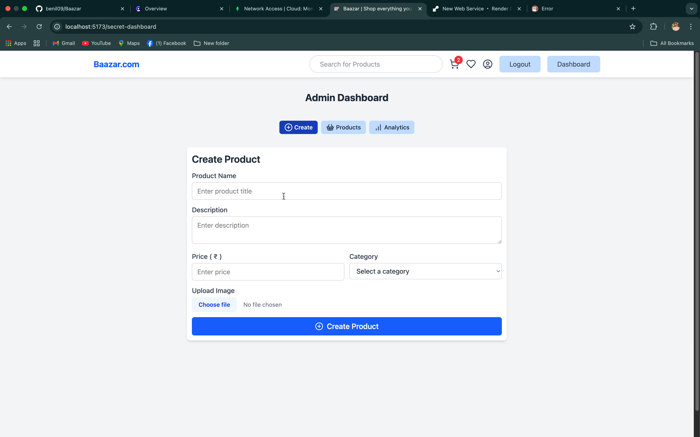
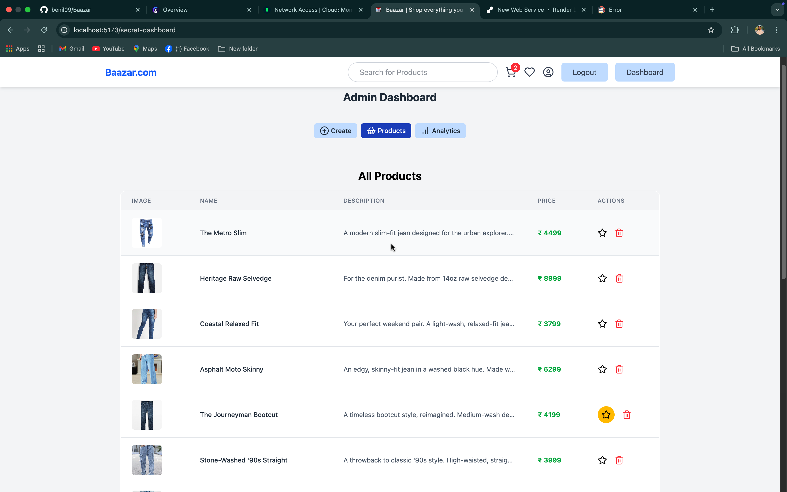
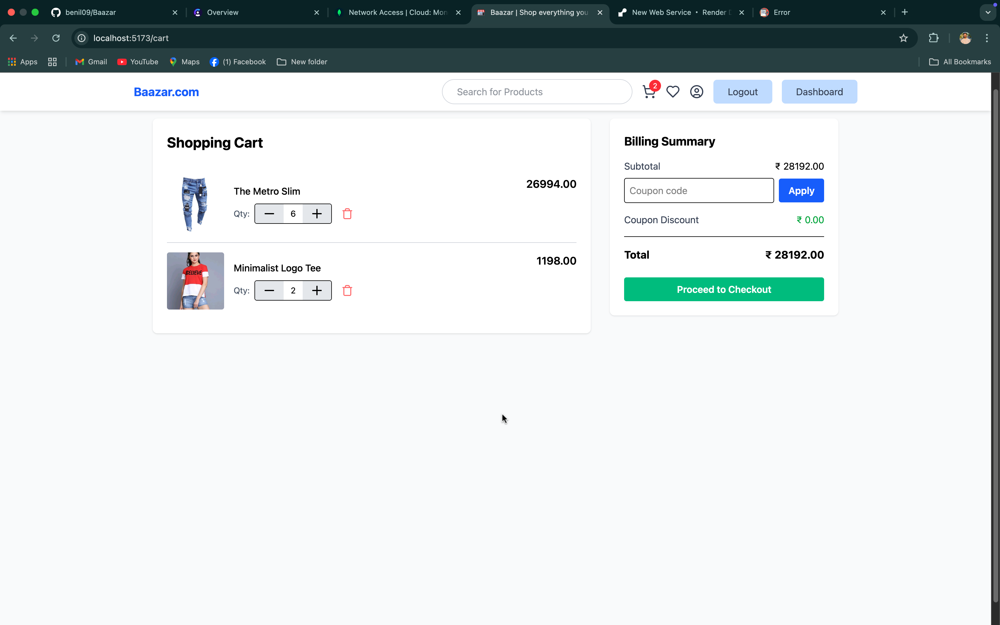

# Baazar

# 🛍️ Baazar

Baazar is a modern and responsive e-commerce web application designed to offer seamless product browsing, management, and analytics for users and admins alike. Built with the MERN stack (MongoDB, Express.js, React.js, Node.js), it provides a robust and scalable solution for online shopping experiences.

## 🚀 Features

### 👥 User Side
- View products by category
- Add to cart & wishlist
- User authentication and authorization
- Responsive UI across devices

### 🛠️ Admin Panel
- Create, update, and delete products
- Upload images for product listings
- View analytics for orders and inventory
- Dashboard with clean navigation

## 🧱 Tech Stack

- **Frontend:** React.js, Tailwind CSS, Framer Motion
- **Backend:** Node.js, Express.js
- **Database:** MongoDB
- **Authentication:** JWT, bcryptjs
- **Image Upload:** Multer (with future cloud support) ,cloudinaryJS
- **Cache/Session (Optional):** Redis, ioredis

## 🛠️ Installation

### Clone the repository

```bash
git clone https://github.com/benil09/Baazar.git
cd baazar
```

### Backend Setup

```bash
cd backend
npm install
npm run dev
```

### Frontend Setup

```bash
cd frontend
npm install
npm start
```

## 📁 Folder Structure

```
Baazar.com/
├── backend/
│   └── controllers, routes, models, config
├── frontend/
│   └── components, pages, assets
├── .env
├── .gitignore
└── README.md
```

## 📷 Screenshots





    

## ✨ Future Enhancements

- Payment gateway integration
- Admin order tracking
- Customer support chatbot
- PWA support for offline access

## 🧑‍💻 Author

- Nilkamal Priydarshi  
- [LinkedIn](https://www.linkedin.com/in/nil-kamal-93945a294/)  
- [Instagram - Nil🍂](https://www.instagram.com/_hola_its.nil_/)  
- Email: nilkamal0624@gmail.com

## 📜 License

This project is licensed under the MIT License.